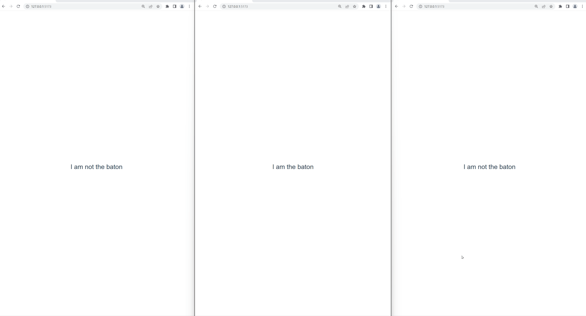

# Vue Baton Passing Prototype

This is a POC of a `useBatonPass` custom composition in Vue. The idea is that, given multiple tabs of the same app,
you only have a single tab that's marked as "having the baton".

This is useful when wanting to create cross-tab communication between apps and having a single tab act as the "conductor"
of the other tabs.

An example of where this is useful is when you want to listen to websockets in multiple tabs, but only want to have
one connection to the server.
